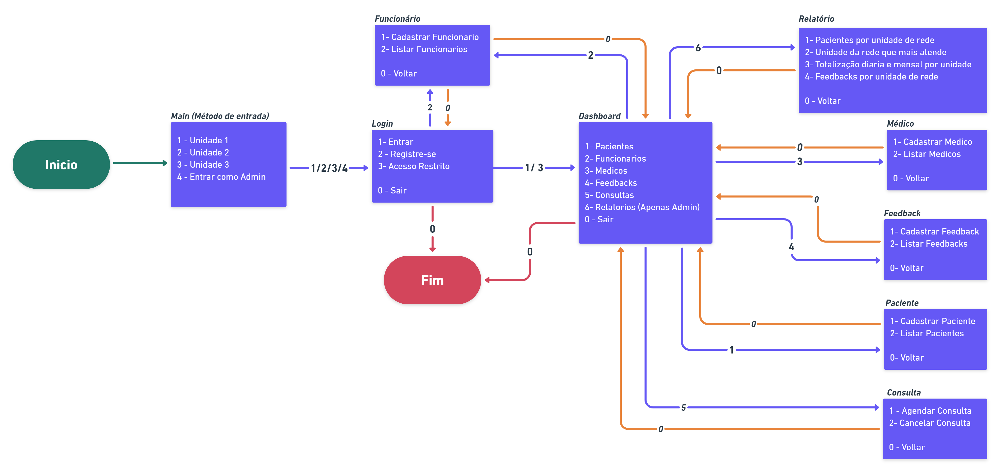
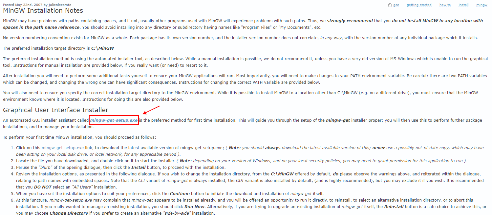
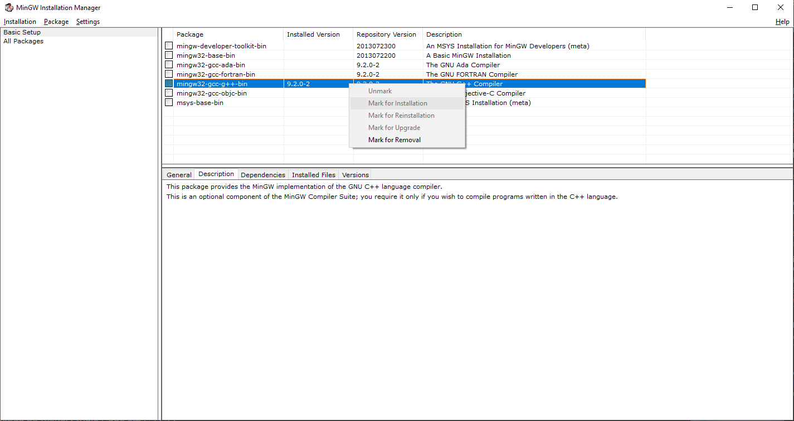
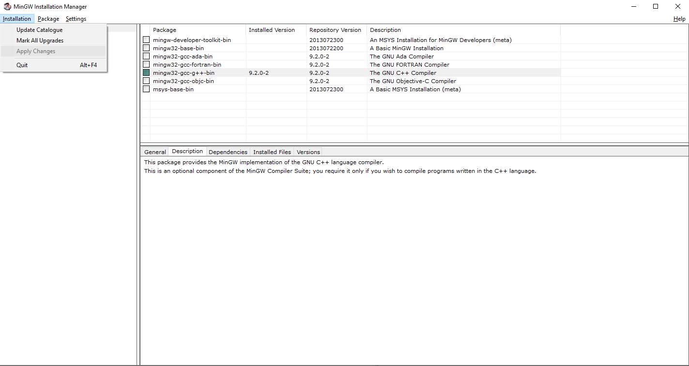
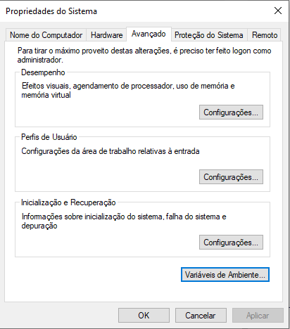
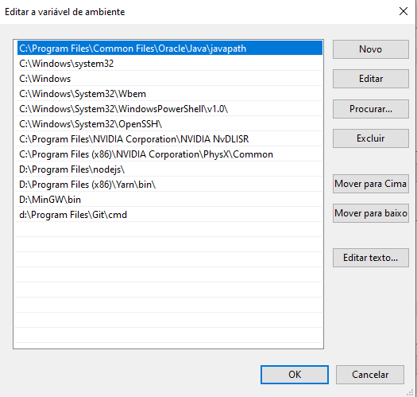
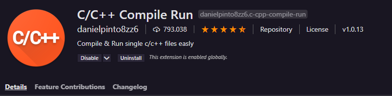
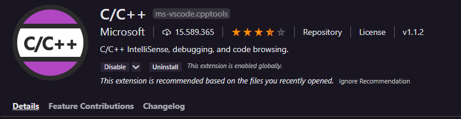

#  *PIM 2 - Análise e Desenvolvimento de Sistemas* 

**Usuários para entrar no sistema:**

*  **Administrador**
    *  *E-mail:* admin@gmail.com  
    *  *Senha:*  12345
* **Unidade 1**
    *  *E-mail:* davi@gmail.com  
    *  *Senha:*  12345
*  **Unidade 2**
    *  *E-mail:* miguel@gmail.com  
    *  *Senha:*  12345
* **Unidade 3**
    *  *E-mail:* gabriel@gmail.com  
    *  *Senha:*  12345
#
## *Fluxograma das telas da aplicação* 

# *Configurar o vscode para compilar códigos C*
1. Instale o compilador [MinGW](http://www.mingw.org/wiki/Getting_Started)

1.1 clicando aonde a seta aponta 

1.2 Selecione "Basic Setup" e marque a caixa de seleção como a imagem abaixo, clique com o botão direito e selecione a opção "Mark for install"

1.3 Clique em "installation" -> "Apply changes"

1.4 Vá nas variáveis ambiente do seu computador 

1.5 Em "Variáveis do sistema" cliquem em "Path" e em seguida "editar" 

1.6 Clique em "Novo" e insira o caminho em que foi instalado o MinGW.

2. No Visual studio code, vá na aba de extensões (ctrl + shift + x) e procure por "C/C++ Compile Run" e "C/C++", instale ambas em seu editor.

3. Para compilar o código, basta entrar no arquivo Main.c e precionar a tecla "F6".
